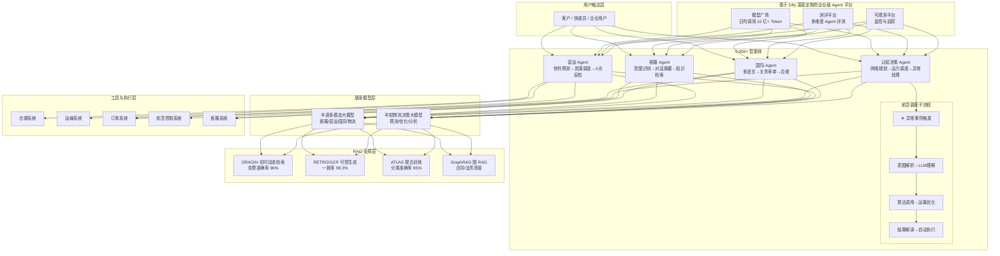
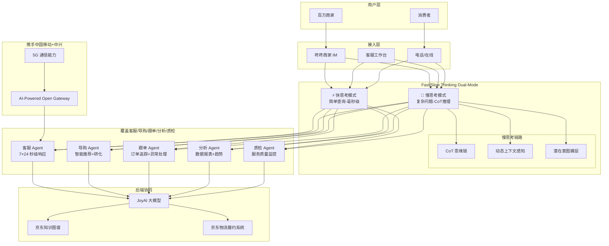
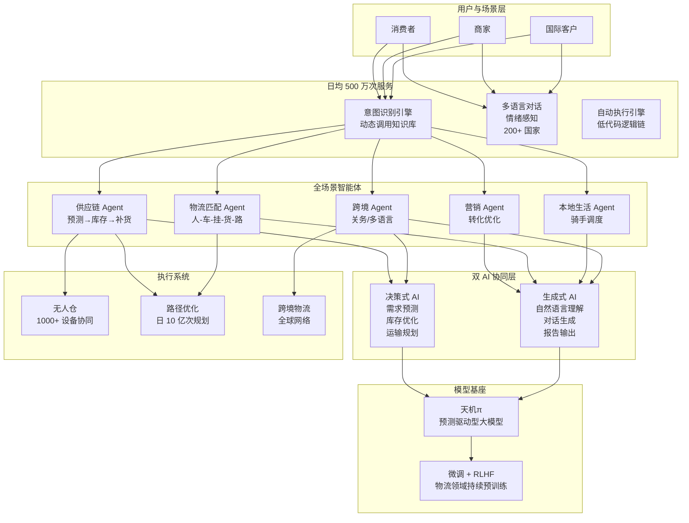
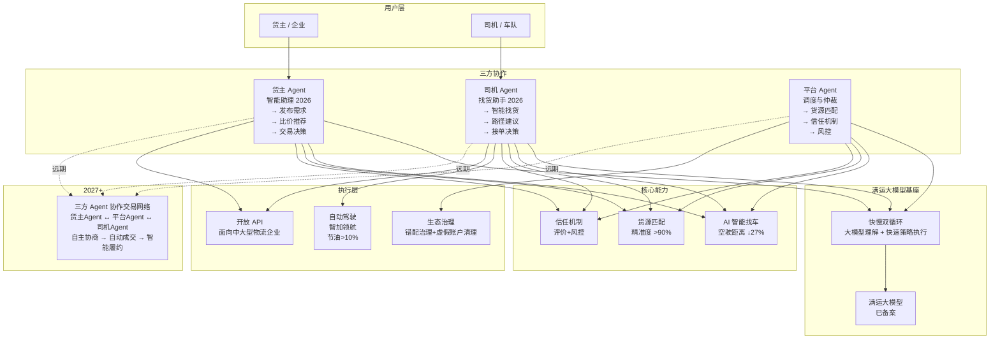
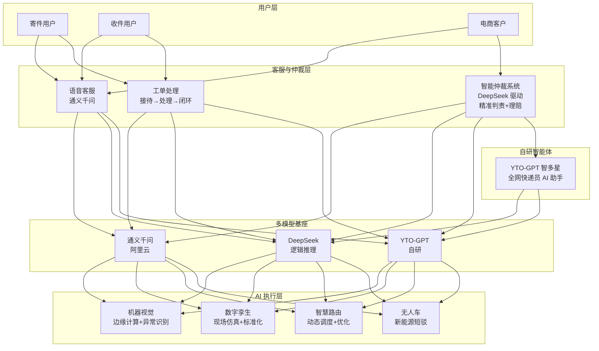
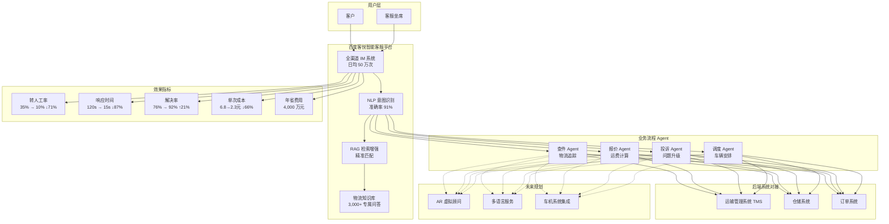
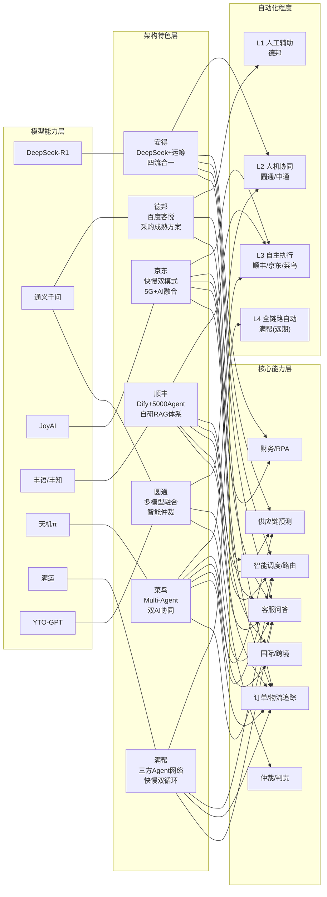

# 供应链物流智能客服 — Agent 架构调度图

> 本文档用 Mermaid 图展示各主要物流供应链公司的 Agent 调度架构与技术路线

---

## 一、顺丰科技 Agent 架构



**调度逻辑说明：**
1. 用户请求 → 路由到对应领域 Agent（客服/营运/国际/决策）
2. Agent 调用「丰语/丰知」大模型进行语义理解与推理
3. 需要外部知识时 → 通过自研 RAG 体系（DRAGIN/RETRO/ATLAS/GraphRAG）检索
4. 需要执行操作时 → 调用对应业务系统（TMS/WMS/OMS）API
5. 返回结构化结果 → 可观测平台记录全链路 trace
6. 认知决策 Agent 具备自主闭环能力：异常触发 → 意图解析 → 算法调度 → 结果执行

---

## 二、京东物流（京小智）Agent 架构



**调度逻辑说明：**
1. 商家/消费者 → 通过咚咚 IM / 客服工作台 / 电话进入
2. **京小智双模式调度器**判断：
   - **快思考**：简单查询（查物流、查订单）→ 毫秒级直接返回
   - **慢思考**：复杂问题（退换货纠纷、多订单合并）→ 启动 CoT 思维链 + 上下文感知 + 意图捕捉
3. 分配到对应 Agent 数字员工（客服/导购/跟单/分析/质检）
4. 调用 JoyAI 大模型 + 知识图谱 + 履约系统
5. 5G+AI 融合网关实现秒级响应
6. 全链路可解释：慢思考模式完整展示 AI 推理过程

---

## 三、菜鸟网络 Agent 架构



**调度逻辑说明：**
1. 消费者/商家/国际客户 → 意图识别引擎 + 多语言对话入口
2. Route 到对应场景 Agent（供应链/营销/物流匹配/本地生活/跨境）
3. **双 AI 协同**：决策式 AI 负责预测与优化（确定性任务），生成式 AI 负责 NLU 与对话（开放性任务）
4. 供应链 Agent 接入无人仓和路径优化系统
5. 跨境 Agent 结合决策+生成双 AI，覆盖 200+ 国家和地区
6. 低代码执行引擎允许业务人员自定义服务逻辑链

---

## 四、满帮集团 Agent 架构



**调度逻辑说明：**
1. **快慢双循环**：大模型理解用户意图（慢）→ 策略引擎快速执行（快）
2. 三方 Agent 各司其职：
   - **货主 Agent**：代货主比价、推荐、辅助交易决策
   - **司机 Agent**：帮司机找货、规划路径、辅助接单决策
   - **平台 Agent**：居中调度、信任担保、风控仲裁
3. 当前阶段各 Agent 以**辅助决策**为主（建立信任）
4. 远期（2027+）演进为**三方自主协商 → 自动成交 → 智能履约**的全自动交易网络
5. 自动驾驶（智加领航）作为干线运输的物理执行层

---

## 五、圆通速递 Agent 架构



**调度逻辑说明：**
1. 用户通过语音/在线/工单进入客服系统
2. 简单问题 → 通义千问语音客服直接解决
3. 纠纷/理赔 → **智能仲裁系统**基于 DeepSeek 的逻辑推理能力精准判责
4. 快递员端 → YTO-GPT 智多星智能体提供 AI 助手服务
5. 后端多模型协同：通义千问处理通用对话，DeepSeek 处理逻辑推理，YTO-GPT 处理垂直场景
6. 视觉/数字孪生/智慧路由/无人车作为 AI 能力的物理执行出口

---

## 六、安得智联 Agent 架构

```mermaid
flowchart TB
    subgraph 用户层
        B["品牌商 / 制造商"]
        R["零售商"]
        C["消费者"]
    end

    subgraph 安链通智慧供应链平台
        SCP["供应链决策大模型<br>专家级方案输出"]
        OPT["运筹优化算法<br>多仓串提+动态路径"]
        SIM["智能体仿真<br>场景推演"]
    end

    subgraph 安链云 SaaS 平台 [四流合一]
        BIZ["商流"]
        LOG["物流"]
        FIN["资金流"]
        INFO["信息流"]
    end

    subgraph AI 应用层
        PRED["多模态销量预测<br>生成式AI建模"]
        REP["智能补调<br>自动补货计划"]
        DIS["智能调度<br>车辆利用率↑"]
        CS["智慧客服<br>7×24 自动录单<br>RPA 财务对账"]
        TRACE["全链路可视<br>异常预警"]
    end

    subgraph 模型基座
        DR["DeepSeek-R1 满血版"]
        ECO["行业生态协同<br>智麦联采联盟"]
    end

    B & R & C --> SCP & CS
    SCP --> OPT & SIM
    OPT & SIM --> PRED & REP & DIS
    PRED & REP & DIS --> LOG
    CS --> LOG & FIN & INFO
    BIZ & LOG & FIN & INFO --> 安链云 SaaS 平台
    SCP --> DR
    DR --> ECO
    TRACE --> LOG
```

**调度逻辑说明：**
1. 品牌商/零售商 → 安链通平台（供应链决策大模型）
2. **决策大模型**输出专家级方案 → 运筹优化算法计算最优解 → 智能体仿真推演验证
3. **四流合一 SaaS 平台**：商流驱动物流、资金流、信息流协同
4. AI 应用层覆盖全链路：预测→补货→调度→客服→追踪
5. 客服场景：7×24 自动录单 + RPA 财务对账自动化
6. DeepSeek-R1 作为核心推理引擎，支持供应链决策
7. 通过"智麦联采"联盟实现行业生态协同

---

## 七、德邦快递 Agent 架构



**调度逻辑说明：**
1. 客户/坐席 → 全渠道 IM 系统
2. NLP 意图识别（91% 准确率）→ 分类到对应业务 Agent
3. 各 Agent 通过 RAG 检索 3,000+ 条物流知识库
4. 需要执行操作时 → 对接 TMS/WMS/OMS 三大后端系统
5. 查件/报价/投诉/调度四种 Agent 各司其职
6. 简单问题直接解决，复杂问题转人工（仅 10%）
7. 效果数据透明可量化

---

## 八、行业 Agent 架构总览对比



---

## 九、Agent 调度模式总结

| 企业 | 调度模式 | 核心调度器 | Agent 数量/类型 |
|------|----------|-----------|----------------|
| **顺丰科技** | 领域路由 + Dify 平台 | 自研 Agent 编排引擎 | 5,000+，4 大领域 |
| **京东物流** | 快慢双模式调度 | Fast/Slow Thinking 调度器 | 5 类数字员工 |
| **菜鸟网络** | 场景路由 + Multi-Agent | 意图识别 + 双 AI 协同 | 5 大场景 Agent |
| **满帮集团** | 三方 Agent 网络 | 快慢双循环调度 | 3 方 Agent |
| **圆通速递** | 多模型融合路由 | 问题分级调度 | 1 个 YTO-GPT |
| **安得智联** | 决策大模型 + 运筹优化 | 供应链决策引擎 | 多应用 Agent |
| **德邦快递** | 意图分类路由 | 百度客悦平台 | 4 类业务 Agent |

### 关键趋势

1. **从单 Agent 到 Multi-Agent**：顺丰（5,000+）、菜鸟（Multi-Agent）、满帮（三方网络）已率先进入多智能体协作阶段
2. **从串行到并行+博弈**：满帮的"货主-司机-平台"三方 Agent 不是简单的串行流水线，而是**博弈协商式调度**
3. **从外部采购到自研平台**：顺丰基于 Dify 定制、京东自研引擎、菜鸟自研 Multi-Agent 框架，头部企业都在构建自己的 Agent 基础设施
4. **快慢分离成为共识**：京东（快慢思考）、满帮（快慢双循环）不约而同选择了"简单问题秒级、复杂问题深度推理"的架构
5. **Agent 与物理世界闭环**：顺丰的航空调度 Agent 直接控制运力、菜鸟的 Agent 调度无人仓设备、满帮的 Agent 连接自动驾驶重卡 — Agent 正在从"信息层"走向"执行层"

---

*本文档由 Claude Code 基于公开信息调研整理，2026-07-23*
