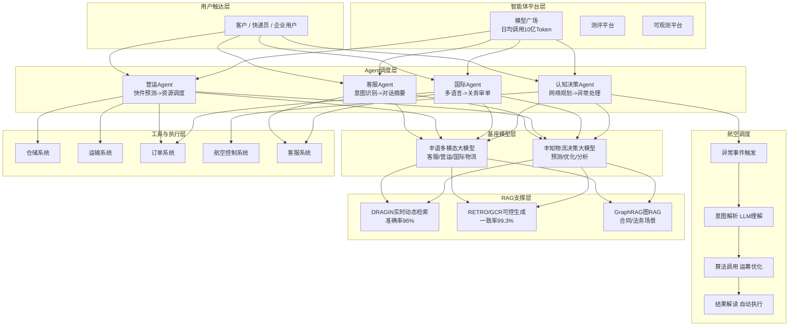
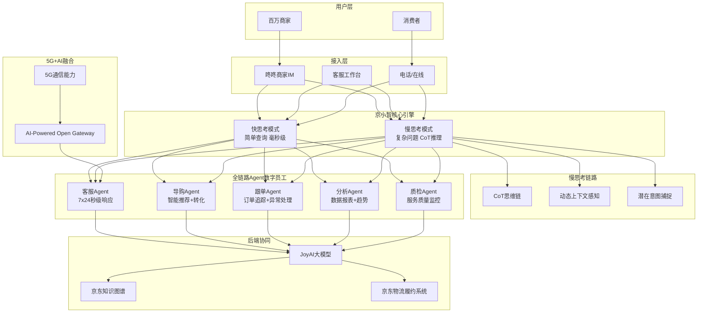
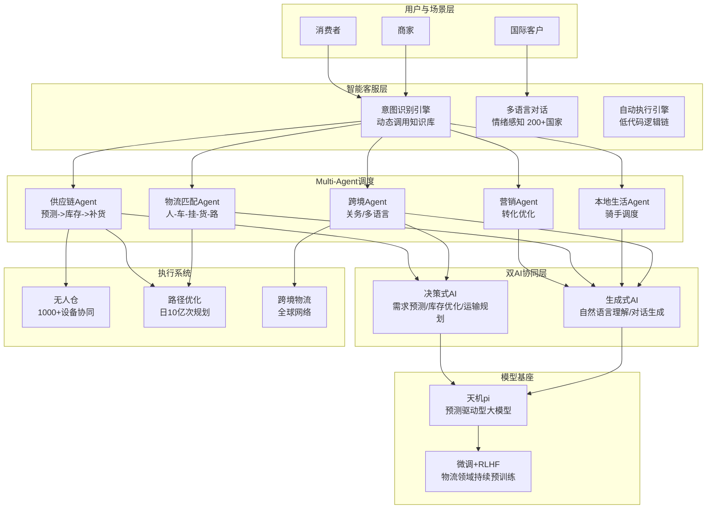
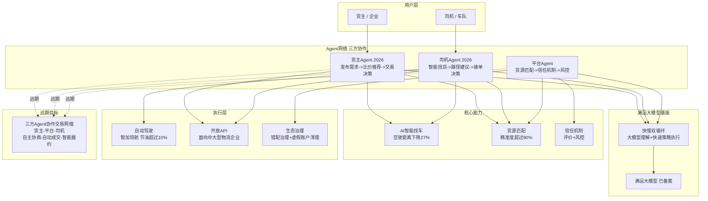
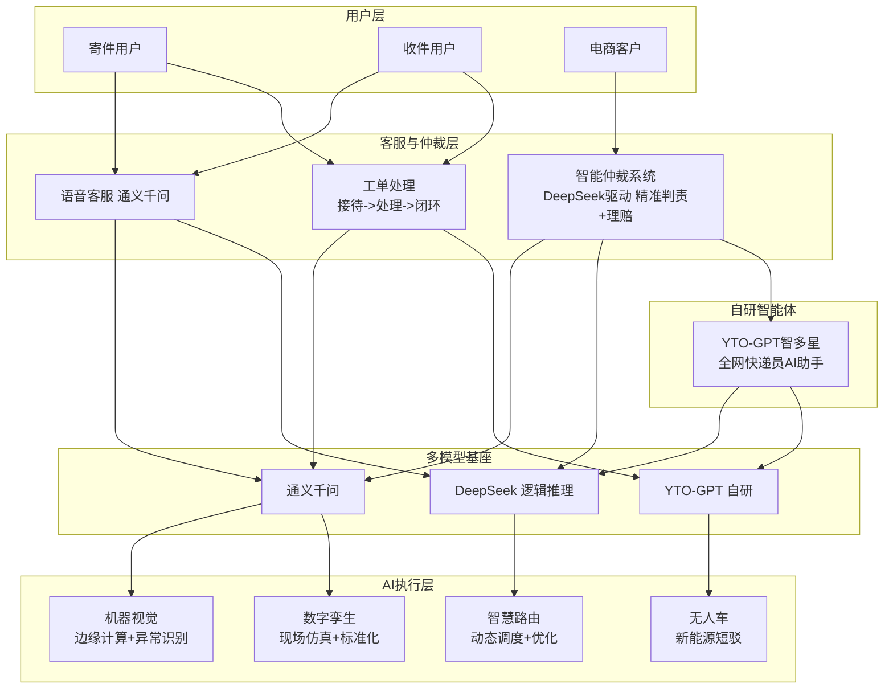
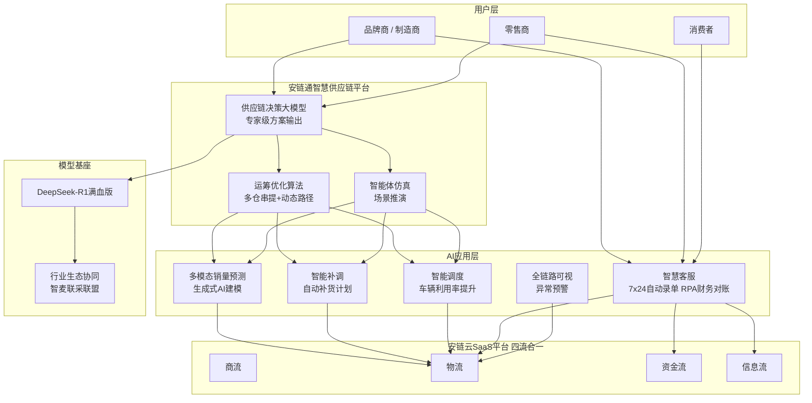
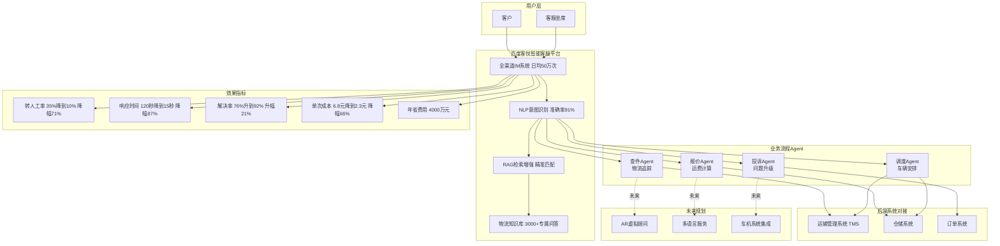

# 供应链物流智能客服 — Agent 架构调度图

> 本文档用 Mermaid 图展示各主要物流供应链公司的 Agent 调度架构与技术路线

---

## 一、顺丰科技 Agent 架构

**调度逻辑说明：**
1. 用户请求被路由到对应领域 Agent（客服/营运/国际/决策）
2. Agent 调用「丰语/丰知」大模型进行语义理解与推理
3. 需要外部知识时通过自研 RAG 体系检索
4. 需要执行操作时调用对应业务系统 API
5. 认知决策 Agent 具备自主闭环能力：异常触发 → 意图解析 → 算法调度 → 结果执行

---

## 二、京东物流（京小智）Agent 架构

**调度逻辑说明：**
1. **京小智双模式调度器**判断：快思考（简单查询毫秒级）或慢思考（复杂问题 CoT 推理）
2. 分配到对应 Agent 数字员工（客服/导购/跟单/分析/质检）
3. 调用 JoyAI 大模型 + 知识图谱 + 履约系统
4. 5G+AI 融合网关实现秒级响应
5. 慢思考模式完整展示 AI 推理过程，具备可解释性

---

## 三、菜鸟网络 Agent 架构

**调度逻辑说明：**
1. 消费者/商家/国际客户 → 意图识别引擎 + 多语言对话入口
2. Route 到对应场景 Agent（供应链/营销/物流匹配/本地生活/跨境）
3. **双 AI 协同**：决策式 AI 负责预测与优化，生成式 AI 负责 NLU 与对话
4. 供应链 Agent 接入无人仓和路径优化系统
5. 跨境 Agent 结合决策+生成双 AI，覆盖 200+ 国家和地区

---

## 四、满帮集团 Agent 架构

**调度逻辑说明：**
1. **快慢双循环**：大模型理解用户意图（慢）→ 策略引擎快速执行（快）
2. 三方 Agent 各司其职：货主 Agent（比价推荐）、司机 Agent（找货接单）、平台 Agent（调度仲裁）
3. 当前阶段各 Agent 以辅助决策为主，建立信任
4. 远期（2027+）演进为三方自主协商 → 自动成交 → 智能履约的全自动交易网络
5. 自动驾驶（智加领航）作为干线运输的物理执行层

---

## 五、圆通速递 Agent 架构

**调度逻辑说明：**
1. 用户通过语音/在线/工单进入客服系统
2. 简单问题 → 通义千问语音客服直接解决
3. 纠纷/理赔 → 智能仲裁系统基于 DeepSeek 精准判责
4. 快递员端 → YTO-GPT 智多星提供 AI 助手服务
5. 后端多模型协同：通义千问（通用对话）、DeepSeek（逻辑推理）、YTO-GPT（垂直场景）

---

## 六、安得智联 Agent 架构

**调度逻辑说明：**
1. 品牌商/零售商 → 安链通平台（供应链决策大模型）
2. 决策大模型输出专家级方案 → 运筹优化算法计算最优解 → 智能体仿真推演验证
3. **四流合一**：商流驱动物流、资金流、信息流协同
4. AI 应用层覆盖全链路：预测 → 补货 → 调度 → 客服 → 追踪
5. DeepSeek-R1 作为核心推理引擎，通过"智麦联采"联盟实现行业生态协同

---

## 七、德邦快递 Agent 架构

**调度逻辑说明：**
1. 客户/坐席 → 全渠道 IM 系统
2. NLP 意图识别（91% 准确率）→ 分类到对应业务 Agent
3. 各 Agent 通过 RAG 检索 3000+ 条物流知识库
4. 需要执行操作时对接 TMS/WMS/OMS 三大后端系统
5. 简单问题直接解决，复杂问题转人工（仅 10%）
6. 效果数据透明可量化：年省 4000 万

---

## 八、行业 Agent 架构总览对比

```mermaid
flowchart TB
    subgraph 模型能力层
        DS1["DeepSeek-R1"]
        QW1["通义千问"]
        JOY1["JoyAI"]
        FY1["丰语/丰知"]
        TJ1["天机pi"]
        MY1["满运"]
        YT1["YTO-GPT"]
    end

    subgraph 架构特色层
        SF1["顺丰<br>Dify+5000Agent+自研RAG"]
        JD1["京东<br>快慢双模式+5G+AI融合"]
        CN1["菜鸟<br>Multi-Agent+双AI协同"]
        MP1["满帮<br>三方Agent网络+快慢双循环"]
        YT2["圆通<br>多模型融合+智能仲裁"]
        AD1["安得<br>DeepSeek+运筹+四流合一"]
        DB1["德邦<br>百度客悦+采购成熟方案"]
    end

    subgraph 核心能力层
        K1["客服问答"]
        K2["订单/物流追踪"]
        K3["智能调度/路由"]
        K4["供应链预测"]
        K5["国际/跨境"]
        K6["财务/RPA"]
        K7["仲裁/判责"]
    end

    subgraph 自动化程度
        L1["L1人工辅助 德邦"]
        L2["L2人机协同 圆通/安得"]
        L3["L3自主执行 顺丰/京东/菜鸟"]
        L4["L4全链路自动 满帮(远期)"]
    end

    DS1 --- AD1
    QW1 --- YT2
    QW1 --- DB1
    JOY1 --- JD1
    FY1 --- SF1
    TJ1 --- CN1
    MY1 --- MP1
    YT1 --- YT2

    SF1 --> K1
    SF1 --> K2
    SF1 --> K3
    SF1 --> K4
    SF1 --> K5
    JD1 --> K1
    JD1 --> K2
    JD1 --> K3
    JD1 --> K6
    CN1 --> K1
    CN1 --> K2
    CN1 --> K3
    CN1 --> K4
    CN1 --> K5
    MP1 --> K1
    MP1 --> K2
    MP1 --> K3
    YT2 --> K1
    YT2 --> K7
    AD1 --> K1
    AD1 --> K3
    AD1 --> K4
    AD1 --> K6
    DB1 --> K1
    DB1 --> K2

    SF1 --> L3
    JD1 --> L3
    CN1 --> L3
    MP1 --> L4
    YT2 --> L2
    AD1 --> L2
    DB1 --> L1
```

---

## 九、Agent 调度模式总结

| 企业 | 调度模式 | 核心调度器 | Agent 数量/类型 |
|------|----------|-----------|----------------|
| **顺丰科技** | 领域路由 + Dify 平台 | 自研 Agent 编排引擎 | 5,000+，4 大领域 |
| **京东物流** | 快慢双模式调度 | Fast/Slow Thinking 调度器 | 5 类数字员工 |
| **菜鸟网络** | 场景路由 + Multi-Agent | 意图识别 + 双 AI 协同 | 5 大场景 Agent |
| **满帮集团** | 三方 Agent 网络 | 快慢双循环调度 | 3 方 Agent |
| **圆通速递** | 多模型融合路由 | 问题分级调度 | 1 个 YTO-GPT |
| **安得智联** | 决策大模型 + 运筹优化 | 供应链决策引擎 | 多应用 Agent |
| **德邦快递** | 意图分类路由 | 百度客悦平台 | 4 类业务 Agent |

### 关键趋势

1. **从单 Agent 到 Multi-Agent**：顺丰（5,000+）、菜鸟（Multi-Agent）、满帮（三方网络）已率先进入多智能体协作阶段
2. **从串行到并行+博弈**：满帮的"货主-司机-平台"三方 Agent 是博弈协商式调度
3. **从外部采购到自研平台**：头部企业都在构建自己的 Agent 基础设施
4. **快慢分离成为共识**：京东（快慢思考）、满帮（快慢双循环）都选择了"简单问题秒级、复杂问题深度推理"的架构
5. **Agent 与物理世界闭环**：顺丰的航空调度 Agent 控制运力、菜鸟的 Agent 调度无人仓设备、满帮的 Agent 连接自动驾驶重卡

---

*本文档由 Claude Code 基于公开信息调研整理，2026-07-23*
