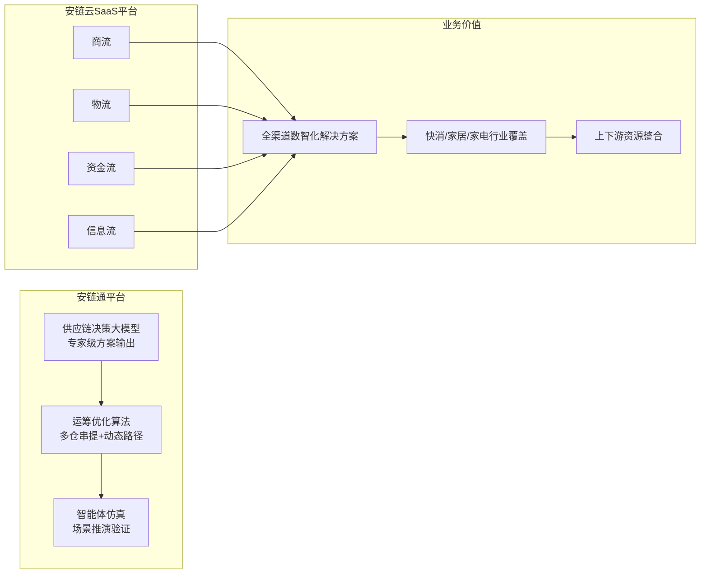
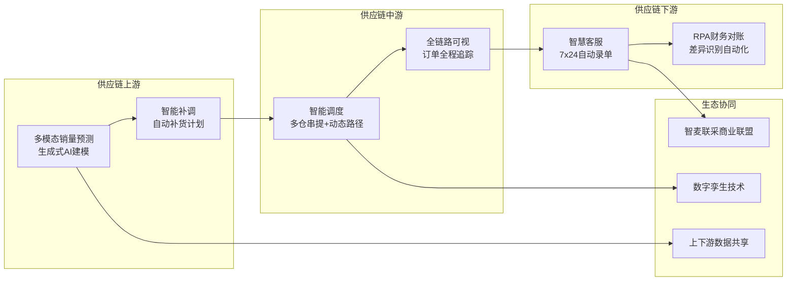
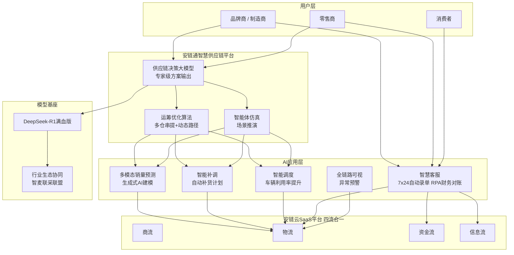

# 安得智联 — 智能客服与 AI 技术方案深度调研

> 调研日期：2026-07-23
> 文档说明：本文整合了安得智联的行业调研数据与 Agent 架构设计，作为供应链物流智能客服项目的专项参考

---

## 一、企业概览

**安得智联**（ANDE Intelligence）是美的集团旗下供应链（物流）服务商，聚焦快消、家电、家居等行业。依托美的制造业基因，强于供应链协同与产销联动，致力于提供端到端的数智化供应链解决方案。

### 1.1 核心经营数据（截至 2025 年底）

| 指标 | 数据 | 来源 |
|------|------|------|
| **年营收** | **214.52 亿元**（2025 年），同比增长 ~14.9%，三年复合增长 15.0% | 招股书 |
| **净利润** | 约 **4.3 亿元**（净利率约 2%） | 招股书 |
| **研发投入** | 每年近 **2 亿元** | 公开资料 |
| **研发人员** | **300+** 名 | 公开资料 |
| **员工规模** | 73,000 ~ 77,000 名（含司机及送装工程师团队） | 招股书 |

### 1.2 客户规模

| 指标 | 数据 |
|------|------|
| **企业客户总数** | **17,006 家**（独立客户） |
| **一体化供应链客户** | **13,815 家** |
| **核心大客户（年贡献 >3,000 万元）** | **71 家** |
| **中国产业领军企业客户** | **37 家** |
| **前五大客户占比** | 48.7%（客户集中度较高） |
| **最大客户（美的集团）** | 占比 39.6%（约 85 亿元） |
| **外部客户收入占比** | **60.4%**（业务独立性持续增强） |
| **覆盖行业** | 家电、快消品、汽车及零部件等 **21 个垂直行业** |

### 1.3 基础设施与数字化规模

| 指标 | 数据 |
|------|------|
| **仓储总面积** | **超 1,100 万平方米** |
| **仓库总数** | **508 个**（自有 47 + 租赁 439 + 代管 22） |
| **核心业务系统** | **69 个** |
| **服务器/主机规模** | **3,000+ 台**（含裸金属和虚拟机） |
| **部署模式** | 混合部署：裸金属 + 虚拟机 + **Kubernetes 容器化**演进 |
| **对外服务模式** | **SaaS 化**（安链云平台） |
| **司机及送装工程师** | 73,000 ~ 77,000 名 |

### 1.4 运营数据

| 指标 | 数据 |
|------|------|
| **年营收** | 214.52 亿元（2025） |
| **最后一公里送装一体** | **2,720 万单/年**（2025 年），客户满意度 97.7% |
| **重庆 CM 项目日均单量** | **40,000 单/日**（单个项目） |
| **北京区域日均吞吐量** | **2,000 立方米/日** |
| **年度吞吐量（单个仓储中心）** | 抛货 19 万方/年 + 重货 4.5 万吨/年 |

> **说明**：以上运营数据为部分区域/项目披露数据。因安得智联为拟上市公司，招股书中未披露全集团日均订单总量。

---

## 二、大模型基座与技术平台

### 2.1 核心模型接入

| 项目 | 内容 |
|------|------|
| **核心模型** | 接入 **DeepSeek-R1 满血版**（2025 年 2 月正式接入） |
| **技术路线** | AI 大模型 + 运筹优化算法 + 智能体仿真 + 数字孪生 |
| **定位** | 标志着安得智联在物流行业数字化转型中迈入 AI 深度应用阶段 |

### 2.2 两大核心平台



**安链通** — 一体化智慧供应链平台：
- 融合 AI 大模型、运筹优化算法、智能体仿真等技术
- 具备供应链决策大模型能力，能够输出专家级方案
- 支持多仓串提、动态路径优化等高级调度

**安链云 SaaS 平台** — 四流合一：
- 打通商流、物流、资金流、信息流
- 为快消、家居等行业提供全渠道数智化解决方案
- 推动跨行业数据共享与资源整合

---

## 三、智能客服能力

### 3.1 客服体系概览

| 能力 | 说明 |
|------|------|
| **7×24 全天候** | AI 客服全时段在线，快速解答客户疑问 |
| **智能语音助手** | 简化沟通流程，提升客户体验 |
| **自动录单** | AI 自动识别单据信息，减少人工录入 |
| **RPA 财务对账** | 财务差异识别与数据抓取自动化 |
| **四流合一** | 打通商流、物流、资金流、信息流，实现全流程透明 |

### 3.2 客服技术特色

安得智联的智能客服不仅仅是"问答机器人"，而是深度嵌入供应链流程的**业务型客服**：

- **单据自动化**：AI 自动识别和录入运单信息，减少人工录入错误
- **财务对账 RPA**：自动抓取财务数据、识别差异，大幅缩短对账周期
- **全链路可视**：客户可实时查看从发货到签收的完整物流轨迹
- **异常预警**：系统自动监测异常事件并主动推送预警

---

## 四、全链路 AI 应用



### 4.1 智能预测

- **多模态多尺度销量预测**：AI 算法融合生成式 AI 建模
- 解决不同特征商品需匹配不同算法参数的技术难题
- 为库存管理和补货计划提供数据支撑

### 4.2 智能补货与调度

| 能力 | 效果 |
|------|------|
| **智能补货计划** | 系统自动生成补货建议，减少库存积压和缺货风险 |
| **多仓串提调度** | 自研智能调度算法，支持多仓库联合调度 |
| **动态路径优化** | 实时优化配送路径，大幅提升车辆利用率和配送效率 |

### 4.3 行业生态协同

- 发起 **"智麦联采商业联盟"**，推动上下游资源整合
- 应用数字孪生技术，实现供应链场景仿真
- 跨行业数据共享，构建产业协同网络

---

## 五、Agent 架构调度图



**调度逻辑说明：**
1. **品牌商/零售商** → 安链通平台（供应链决策大模型），消费者 → 智慧客服
2. **决策大模型**输出专家级方案 → **运筹优化算法**计算最优解 → **智能体仿真**推演验证
3. **四流合一**：商流驱动物流、资金流、信息流协同
4. AI 应用层覆盖全链路：预测 → 补货 → 调度 → 客服 → 追踪
5. **DeepSeek-R1** 作为核心推理引擎，通过"智麦联采"联盟实现行业生态协同

---

## 六、技术特点总结

```
安得智联 = DeepSeek-R1 基座 + 供应链决策大模型 + 四流合一 SaaS 平台

核心亮点：
1. 依托美的制造业基因，供应链协同能力强
2. 四流合一打通商流/物流/资金流/信息流
3. 预测→补货→调度→客服→追踪全链路 AI 覆盖
4. DeepSeek-R1 满血版驱动供应链决策
5. 智麦联采联盟构建行业生态协同
6. 运筹优化 + 智能体仿真 + 数字孪生技术融合
```

---

## 七、行业定位与差异化

| 维度 | 安得智联 | 差异化优势 |
|------|----------|-----------|
| **基因** | 美的集团旗下，制造业出身 | 比纯物流公司更懂供应链上下游协同 |
| **核心模型** | DeepSeek-R1 + 自研决策大模型 | 供应链垂直场景深度优化 |
| **平台模式** | 安链云 SaaS（四流合一） | 不仅是物流，而是商流+物流+资金流+信息流 |
| **生态策略** | 智麦联采联盟 | 行业联合采购与数据共享 |
| **客户群体** | 快消/家电/家居 | 深耕特定行业的端到端服务 |
| **AI 侧重** | 预测+调度+仿真 | 强于供应链决策层面的 AI 应用 |

---

## 八、IT 基础设施与算力设备

### 8.1 数字化系统矩阵

安得智联建立了以自主研发为核心的数字化系统矩阵：

| 系统 | 功能 |
|------|------|
| **安链云（Anlian Cloud）** | SaaS 化供应链协同平台，集成 B2b/ERP/SCM 等系统集群 |
| **安链通（Anliantong）** | 智慧供应链平台，驱动前瞻智能决策 |
| **鲲鹏系统** | 物流全链路数字化核心系统 |
| **PMS 生产物流系统** | 打通制造上下游信息盲区，提升产销协同 |
| **城配智能调度平台** | 与上海交大合作，自动匹配车型/频次/路径 |
| **小安 AI 引擎** | 集成 DeepSeek-R1 大模型，对话式数据分析与决策支持 |

### 8.2 服务器与基础设施

| 项目 | 数据 |
|------|------|
| **主机规模** | 3,000+ 台（裸金属 + 虚拟机） |
| **核心业务系统** | 69 个 |
| **部署架构** | 混合部署，正向 Kubernetes 容器化微服务架构演进 |
| **监控系统** | 博睿数据 Bonree ONE（全栈 APM + RUM + eBPF 无侵入监控） |

### 8.3 GPU 与 AI 算力

> **说明**：以下信息基于行业对标推断。安得智联作为拟上市公司，在招股书中未披露 GPU 服务器型号、显存配置等详细硬件信息。外部搜索也未能获取其具体采购清单。以下内容基于其 AI 应用场景和技术路线进行合理推算。

#### 已确认的信息

- 已正式接入 **DeepSeek-R1 满血版**大模型
- 自研 **"小安 AI"引擎**，实现对话式数据分析
- 研发人员 **300+** 名，每年研发投入近 **2 亿元**
- 对外采用 **SaaS 模式**交付，内部系统正向云端演进

#### 基于业务场景的算力需求推算

| AI 场景 | 算力需求推测 | 说明 |
|---------|-------------|------|
| **DeepSeek-R1 推理** | 高（需 A100 80G / H800 级别） | 满血版 671B 参数，单卡无法承载，需多卡分布式推理或 API 调用 |
| **供应链决策大模型** | 中高 | 自研垂直模型，训练需多卡 GPU 集群（推测 8×A100 或以上） |
| **多模态销量预测** | 中 | 生成式 AI 建模，GPU 训练 + CPU 推理混合 |
| **智能调度算法** | 中低 | 运筹优化为主，CPU 密集，GPU 为辅 |
| **智能客服（7×24）** | 中 | 在线推理服务，需低延迟 GPU 部署（T4/L20 级别可满足） |
| **RPA 财务对账** | 低 | 规则引擎为主，不依赖 GPU |

#### 行业对标推测配置

考虑到安得智联年研发投入近 2 亿元、300+ 研发人员、且接入了 DeepSeek-R1，其 AI 基础设施推测为：

| 设备类型 | 推测配置 | 用途 |
|----------|---------|------|
| **GPU 训练集群** | 8× NVIDIA A100 80GB / H800 或同等国产卡（昇腾 910B） | DeepSeek 微调、供应链大模型训练 |
| **GPU 推理节点** | NVIDIA L20 / T4 级显卡 | 智能客服 7×24 在线推理 |
| **CPU 计算节点** | 高性能 x86 服务器（Intel Xeon / AMD EPYC） | 运筹优化调度、路径算法、RPA |
| **存储** | 分布式存储（Ceph/MinIO 等） | 物流大数据、模型数据、日志 |
| **网络** | 25GbE / 100GbE 内部网络 | 分布式训练通信 |

> **注**：以上为基于公开业务数据和技术路线的合理推测。安得智联未公开披露其 GPU 型号、显存容量等具体硬件参数。实际配置需与安得智联 IT 部门确认。

- 安得智联正式接入 DeepSeek-R1 满血版 — chinadaily.com.cn
- 安得智联数智化转型实战解析 — ainet.cn
- 2025《数智化供应链白皮书》— 上海交通大学联合发布
- 供应链物流智能客服行业调研报告（本项目的配套报告）

---

*本文档由 Claude Code 基于公开信息调研整理，2026-07-23*
