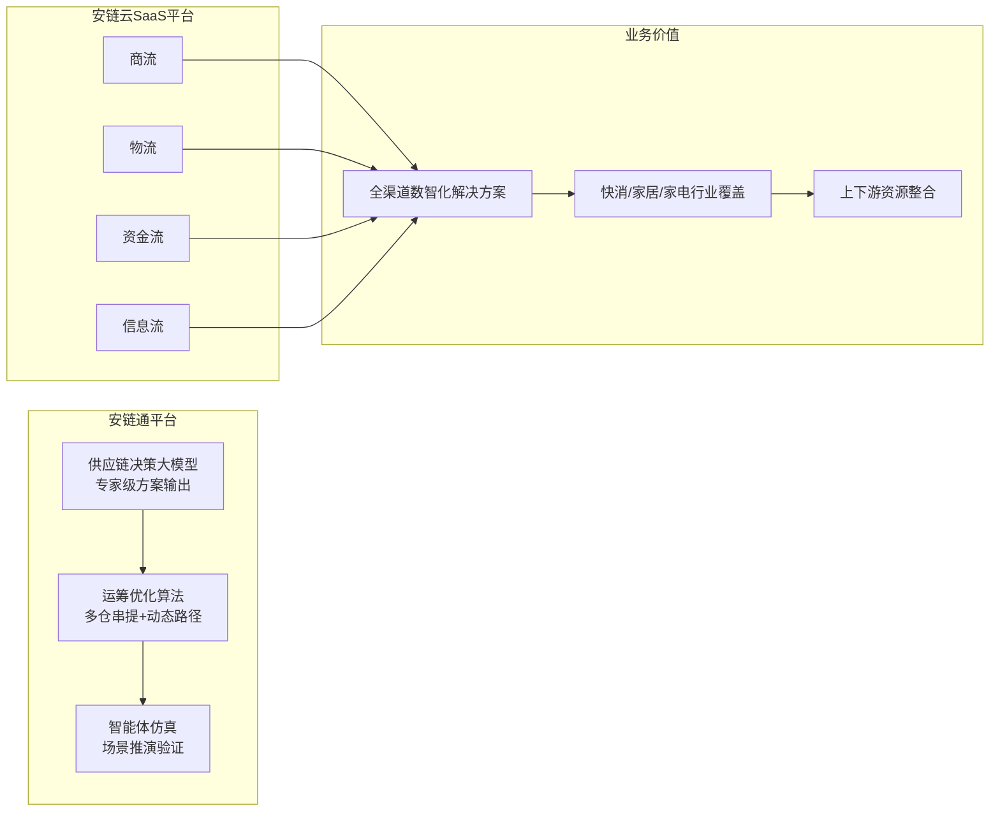
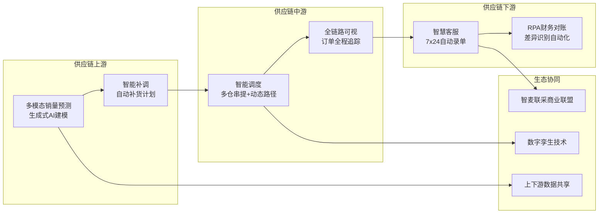
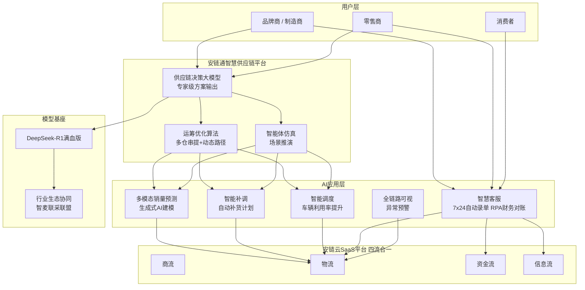

# 安得智联 — 智能客服与 AI 技术方案深度调研

> 调研日期：2026-07-23
> 文档说明：本文整合了安得智联的行业调研数据与 Agent 架构设计，作为供应链物流智能客服项目的专项参考

---

## 一、企业概览

**安得智联**（ANDE Intelligence）是美的集团旗下供应链（物流）服务商，聚焦快消、家电、家居等行业。依托美的制造业基因，强于供应链协同与产销联动，致力于提供端到端的数智化供应链解决方案。

---

## 二、大模型基座与技术平台

### 2.1 核心模型接入

| 项目 | 内容 |
|------|------|
| **核心模型** | 接入 **DeepSeek-R1 满血版**（2025 年 2 月正式接入） |
| **技术路线** | AI 大模型 + 运筹优化算法 + 智能体仿真 + 数字孪生 |
| **定位** | 标志着安得智联在物流行业数字化转型中迈入 AI 深度应用阶段 |

### 2.2 两大核心平台



**安链通** — 一体化智慧供应链平台：
- 融合 AI 大模型、运筹优化算法、智能体仿真等技术
- 具备供应链决策大模型能力，能够输出专家级方案
- 支持多仓串提、动态路径优化等高级调度

**安链云 SaaS 平台** — 四流合一：
- 打通商流、物流、资金流、信息流
- 为快消、家居等行业提供全渠道数智化解决方案
- 推动跨行业数据共享与资源整合

---

## 三、智能客服能力

### 3.1 客服体系概览

| 能力 | 说明 |
|------|------|
| **7×24 全天候** | AI 客服全时段在线，快速解答客户疑问 |
| **智能语音助手** | 简化沟通流程，提升客户体验 |
| **自动录单** | AI 自动识别单据信息，减少人工录入 |
| **RPA 财务对账** | 财务差异识别与数据抓取自动化 |
| **四流合一** | 打通商流、物流、资金流、信息流，实现全流程透明 |

### 3.2 客服技术特色

安得智联的智能客服不仅仅是"问答机器人"，而是深度嵌入供应链流程的**业务型客服**：

- **单据自动化**：AI 自动识别和录入运单信息，减少人工录入错误
- **财务对账 RPA**：自动抓取财务数据、识别差异，大幅缩短对账周期
- **全链路可视**：客户可实时查看从发货到签收的完整物流轨迹
- **异常预警**：系统自动监测异常事件并主动推送预警

---

## 四、全链路 AI 应用



### 4.1 智能预测

- **多模态多尺度销量预测**：AI 算法融合生成式 AI 建模
- 解决不同特征商品需匹配不同算法参数的技术难题
- 为库存管理和补货计划提供数据支撑

### 4.2 智能补货与调度

| 能力 | 效果 |
|------|------|
| **智能补货计划** | 系统自动生成补货建议，减少库存积压和缺货风险 |
| **多仓串提调度** | 自研智能调度算法，支持多仓库联合调度 |
| **动态路径优化** | 实时优化配送路径，大幅提升车辆利用率和配送效率 |

### 4.3 行业生态协同

- 发起 **"智麦联采商业联盟"**，推动上下游资源整合
- 应用数字孪生技术，实现供应链场景仿真
- 跨行业数据共享，构建产业协同网络

---

## 五、Agent 架构调度图



**调度逻辑说明：**
1. **品牌商/零售商** → 安链通平台（供应链决策大模型），消费者 → 智慧客服
2. **决策大模型**输出专家级方案 → **运筹优化算法**计算最优解 → **智能体仿真**推演验证
3. **四流合一**：商流驱动物流、资金流、信息流协同
4. AI 应用层覆盖全链路：预测 → 补货 → 调度 → 客服 → 追踪
5. **DeepSeek-R1** 作为核心推理引擎，通过"智麦联采"联盟实现行业生态协同

---

## 六、技术特点总结

```
安得智联 = DeepSeek-R1 基座 + 供应链决策大模型 + 四流合一 SaaS 平台

核心亮点：
1. 依托美的制造业基因，供应链协同能力强
2. 四流合一打通商流/物流/资金流/信息流
3. 预测→补货→调度→客服→追踪全链路 AI 覆盖
4. DeepSeek-R1 满血版驱动供应链决策
5. 智麦联采联盟构建行业生态协同
6. 运筹优化 + 智能体仿真 + 数字孪生技术融合
```

---

## 七、行业定位与差异化

| 维度 | 安得智联 | 差异化优势 |
|------|----------|-----------|
| **基因** | 美的集团旗下，制造业出身 | 比纯物流公司更懂供应链上下游协同 |
| **核心模型** | DeepSeek-R1 + 自研决策大模型 | 供应链垂直场景深度优化 |
| **平台模式** | 安链云 SaaS（四流合一） | 不仅是物流，而是商流+物流+资金流+信息流 |
| **生态策略** | 智麦联采联盟 | 行业联合采购与数据共享 |
| **客户群体** | 快消/家电/家居 | 深耕特定行业的端到端服务 |
| **AI 侧重** | 预测+调度+仿真 | 强于供应链决策层面的 AI 应用 |

---

## 八、参考来源

- 安得智联正式接入 DeepSeek-R1 满血版 — chinadaily.com.cn
- 安得智联数智化转型实战解析 — ainet.cn
- 2025《数智化供应链白皮书》— 上海交通大学联合发布
- 供应链物流智能客服行业调研报告（本项目的配套报告）

---

*本文档由 Claude Code 基于公开信息调研整理，2026-07-23*
