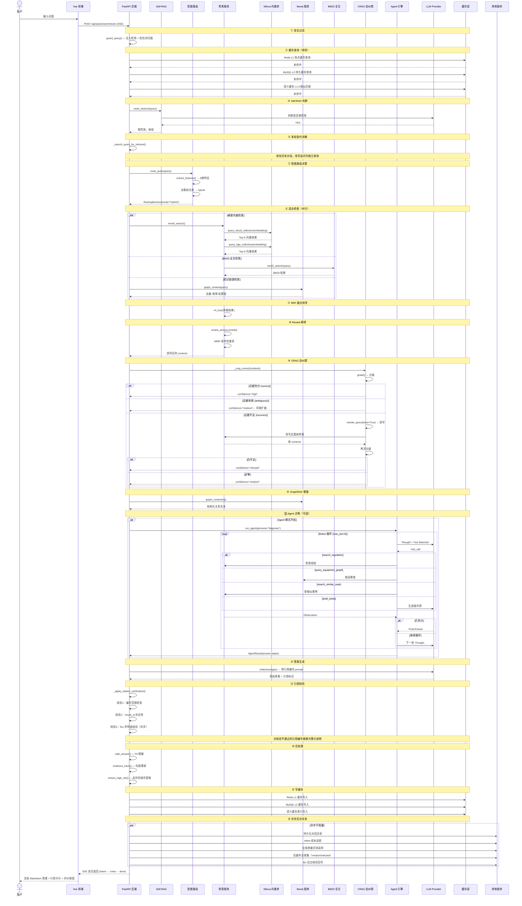
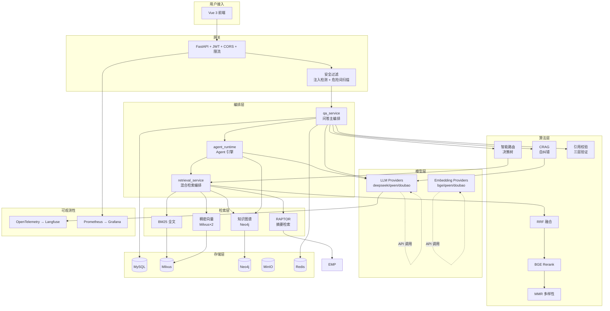

# Grid-QA 电网运维 RAG 智能问答系统 — 技术架构分析

> 本文档全面分析项目的技术栈、模块划分、模块关系、以及涉及的大模型/Agent 相关知识点。

---

## 一、系统定位

**Grid-QA** 是一个面向电网运维领域的 **企业级 RAG（Retrieval-Augmented Generation）智能问答系统**，融合了混合检索、Corrective RAG、ReAct Agent、Multi-Agent 辩论、知识图谱推理、三级缓存、OpenTelemetry 可观测性等技术。

---

## 二、基础设施层（Docker 编排）

系统通过 `docker-compose.yml` 编排 11 个容器服务：

| 服务 | 用途 | 选型理由 |
|------|------|----------|
| **MySQL 8.0** | 结构化数据：用户、文档元数据、Chunk、对话历史、配置、工单、知识治理记录等 | 成熟稳定，ACID 事务保证 |
| **MinIO** | 对象存储：原始文档文件（PDF/DOCX/TXT 等）的持久化 | 兼容 S3 协议，轻量级 |
| **etcd** | Milvus 元数据依赖 | Milvus 的元数据存储后端 |
| **Milvus 2.4** | 向量数据库：稠密向量（云 embedding + 本地 BGE 双 collection） | 专业向量数据库，十亿级向量检索性能 |
| **Redis 7** | 热点问答缓存（L1），运行时配置热读 | 内存级响应速度，支持 LRU 淘汰策略 |
| **Neo4j 5** | 图数据库：设备-故障-处置知识图谱，支持多跳因果推理 | 原生图存储，适合关联关系深度遍历 |
| **Nacos** | 配置中心（可选，默认不依赖） | 动态配置推送 |
| **Prometheus** | 指标采集：QPS、延迟、缓存命中率、Agent 调用次数等 | 标准开源监控方案 |
| **Grafana** | 可视化仪表盘：7 个预置仪表板（Agent 监控、缓存监控、数据飞轮等） | 丰富的图表和告警能力 |
| **Langfuse** | LLM 调用链路追踪（OpenTelemetry OTLP） | 开源 LLM 可观测性平台 |
| **PostgreSQL** | Langfuse 专用数据库 | Langfuse 依赖 |

---

## 三、前端技术栈

| 技术 | 用途 |
|------|------|
| **Vue 3** (Composition API + `<script setup>`) | 前端框架 |
| **Vite** | 构建工具，HMR 开发体验 |
| **Vue Router** | 前端路由（登录、聊天、知识图谱、看板、工单等） |
| **Pinia** | 状态管理（认证状态等） |
| **MarkdownIt + highlight.js** | 渲染 LLM 流式输出的 Markdown 和代码块 |
| **Three.js** | 数字孪生变电站 3D 场景 |
| **SSE** (Server-Sent Events) | 默认流式通信方式 |
| **WebSocket** | 可选的双向流式通信 |
| **Axios** | HTTP 请求 |

### 核心功能页面

- **Chat.vue** — 智能问答对话界面（流式回答、Agent 思考链追踪、引用来源卡片、证据溯源弹窗、置信度徽标、相关追问）
- **KgGraph.vue / KgGraph3D.vue** — 知识图谱可视化（2D/3D）
- **DigitalTwin.vue** — 数字孪生看板
- **OperationsCenter.vue** — 运维中心
- **TicketLifecycle.vue** — 工单生命周期
- **KnowledgeEvolution.vue** — 知识自进化
- **Admin.vue** — 管理后台

---

## 四、后端技术栈

| 技术 | 用途 |
|------|------|
| **Python 3.10+** | 运行时 |
| **FastAPI** | Web 框架（异步高性能，自动 OpenAPI 文档） |
| **Uvicorn** | ASGI 服务器 |
| **SQLAlchemy 2.0** (async) | ORM 异步操作 MySQL |
| **Alembic** | 数据库迁移 |
| **Pydantic v2** | 数据校验和配置管理（`pydantic-settings`） |
| **SlowAPI** | API 速率限制 |
| **Prometheus Client** | 自定义业务指标（`/metrics` 端点） |
| **OpenTelemetry SDK** | LLM 调用链路追踪，导出到 Langfuse |
| **APScheduler / asyncio** | 后台定时任务（备份、日志归档、知识自进化扫描等） |

### 后端模块架构

```
backend/app/
├── main.py                    # 应用入口：生命周期管理 + 中间件 + 路由挂载
├── config.py                  # 全局配置（pydantic-settings 读取 .env）
├── dependencies.py            # 依赖注入（当前用户、权限检查）
│
├── routers/                   # API 路由层
│   ├── qa.py                  # 问答接口（普通/流式/多轮）
│   ├── retrieval.py           # 检索调试接口
│   ├── document.py            # 文档管理（上传/解析/向量化）
│   ├── kg.py                  # 知识图谱接口
│   ├── domain.py              # 领域接口（操作票、相似案例）
│   ├── memory.py              # Agent 记忆接口
│   ├── twin.py                # 数字孪生
│   ├── system.py              # 系统管理
│   ├── task_center.py         # 任务中心
│   ├── realtime_event.py      # 实时事件
│   ├── knowledge_evolution.py # 知识自进化
│   ├── knowledge_governance.py# 知识治理
│   └── retrieval_tune_router.py # 检索调优
│
├── services/                  # 业务逻辑层（核心编排）
│   ├── qa_service.py          # RAG 问答主编排（核心！）
│   ├── retrieval_service.py   # 混合检索编排
│   ├── agent_runtime.py       # 通用 ReAct Agent 引擎
│   ├── agent_tools.py         # Agent 工具集
│   ├── agent_memory_service.py # Agent 记忆（N1）
│   ├── agent_personas.py      # Agent 角色配置
│   ├── diagnose_agent_service.py # Agentic 诊断适配层
│   ├── debate_agent_service.py  # Multi-Agent 辩论
│   ├── self_rag.py            # 检索必要性判断
│   ├── query_rewrite.py       # Query 改写
│   ├── standalone_query.py    # 多轮指代消解
│   ├── multi_query.py         # 多查询分解
│   ├── bm25_service.py        # BM25 全文检索
│   ├── embedding_service.py   # Embedding 调用封装
│   ├── rerank_service.py      # BGE Rerank 重排序
│   ├── kg_service.py          # 知识图谱服务
│   ├── domain_service.py      # 领域服务（操作票生成、相似案例）
│   ├── conversation_service.py# 对话管理
│   ├── parse_service.py       # 文档解析（PDF/DOCX → Chunk）
│   ├── chunk_service.py       # Chunk 管理
│   ├── document_service.py    # 文档管理
│   ├── cache_persist.py       # MySQL 二级缓存（L2）
│   ├── cache_warmup.py        # 缓存预热
│   ├── config_service.py      # 运行时配置（热读缓存）
│   ├── knowledge_evolution_service.py  # 知识自进化
│   ├── knowledge_governance_service.py # 知识治理
│   ├── evidence_gap_service.py  # 证据补全
│   ├── feedback_service.py      # 用户反馈
│   ├── feedback_optimizer_service.py # 反馈驱动缓存调优
│   ├── cost_tracker_service.py   # Token 成本追踪
│   ├── tunnel_service.py         # 多租户隔离
│   ├── ticket_lifecycle_service.py # 工单生命周期
│   ├── alert_disposal_service.py  # 告警处置
│   ├── fault_prediction_service.py # 故障预测
│   ├── realtime_event_service.py  # 实时事件
│   ├── task_center_service.py     # 持久化任务调度
│   ├── online_eval_service.py     # 在线质量评测
│   ├── twin_service.py            # 数字孪生
│   ├── quality_event_bus.py       # 质量事件总线
│   └── ...                        # 其他辅助服务
│
├── rag/                       # RAG 核心算法
│   ├── crag.py                # Corrective RAG v1：检索结果分级 + 纠错闭环
│   ├── crag_v2.py             # CRAG v2：LLM 逐条评估证据相关性
│   ├── mmr.py                 # MMR 多样性重排
│   ├── rrf.py                 # RRF 融合排序
│   ├── raptor.py              # RAPTOR 层次摘要检索
│   ├── judge.py               # LLM-as-Judge 离线幻觉评估
│   ├── citation.py            # 引用补标 (auto_cite)
│   ├── citation_index.py      # 引用编号管理
│   ├── citation_verifier.py   # 三层引用校验
│   ├── prompt_templates.py    # 领域 Prompt 模板
│   └── semantic_cache.py      # 语义相似缓存（L1.5）
│
├── routing/                   # 智能路由层
│   ├── query_classifier.py    # 6 维特征提取 + 决策树
│   ├── routing_service.py     # 路由调度入口
│   └── config.py              # 路由参数配置
│
├── providers/                 # 模型 Provider 抽象层（工厂模式）
│   ├── factory.py             # 工厂：根据配置返回对应 Provider
│   ├── base.py                # 抽象基类
│   └── llm/                   # LLM 实现
│       ├── deepseek_llm.py    # DeepSeek（默认）
│       ├── qwen_llm.py        # 通义千问
│       └── doubao_llm.py      # 豆包
│       └── embedding/         # Embedding 实现
│           ├── bge_embedding.py # BGE（本地模型，离线可用）
│           ├── qwen_embedding.py
│           └── doubao_embedding.py
│
├── mcp/                       # MCP 工具总线
│   ├── server.py              # MCP Server：对外暴露 6 个工具
│   ├── client.py              # MCP Client：接入外部 MCP 服务
│   ├── registry.py            # 工具注册表
│   └── mock_scada_server.py   # 模拟 SCADA 数据源
│
├── models/                    # SQLAlchemy 数据模型
│   ├── user.py / permission.py # 用户与权限
│   ├── document.py / chunk.py  # 文档与分块
│   ├── conversation.py         # 对话
│   ├── kg_triple.py            # 知识图谱三元组
│   ├── agent_memory.py         # Agent 记忆
│   ├── agent_tool_call.py      # Agent 工具调用审计
│   ├── qa_cache.py             # 问答缓存
│   ├── alert_disposal.py       # 告警处置
│   ├── ticket.py               # 工单
│   ├── domain_event.py         # 领域事件
│   ├── quality...              # 质量相关
│   └── ...                     # 其他模型
│
├── core/                      # 核心基础设施
│   ├── safety.py              # 安全合规（注入检测、危险词扫描、PII脱敏）
│   ├── security.py            # JWT 认证
│   ├── permissions.py         # RBAC 权限
│   ├── limiter.py             # 速率限制
│   ├── otel_genai.py          # OpenTelemetry 可观测性
│   ├── obs.py                 # 降级观测（degraded）
│   ├── metrics.py             # Prometheus 业务指标
│   ├── logging.py             # 日志配置
│   ├── response.py            # 统一响应格式
│   └── ws_manager.py          # WebSocket 连接管理
│
├── clients/                   # 外部客户端封装
│   ├── milvus_client.py       # Milvus 向量库
│   ├── redis_client.py        # Redis 缓存
│   ├── neo4j_client.py        # Neo4j 图库
│   ├── minio_client.py        # MinIO 对象存储
│   └── nacos_client.py        # Nacos 配置中心
│
├── db/                        # 数据库初始化
│   ├── base.py                # SQLAlchemy Base
│   ├── session.py             # 会话管理
│   └── init_db.py             # 建表 + 初始数据
│
└── schemas/                   # Pydantic 请求/响应 Schema
```

---

## 五、核心调用链路时序图



---

## 六、大模型 & Agent 深度解析

### 6.1 RAG（Retrieval-Augmented Generation）— 检索增强生成

**核心思想**：不让 LLM 凭记忆回答，先从知识库检索相关文档，再注入 prompt 让 LLM 基于资料回答。

#### 本项目 RAG 演进路线

```
基础 RAG → 混合检索(BM25+向量) → Rerank → CRAG自纠错 → Agent RAG → Multi-Agent Debate
    v1            v2                   v3           v4             v5              v6
```

#### 全链路流程

```
query → Self-RAG判断 → 智能路由 → query改写 → 多查询分解
→ BM25 & 向量 & 图谱 & RAPTOR 并行检索 → RRF融合 → Rerank精排
→ MMR去冗余 → CRAG分级纠错 → GraphRAG增强
→ Agent调工具交叉验证(可选) → LLM生成 → 引用校验 → 后处理 → 缓存
```

#### 为什么 RAG 比纯 LLM 更适合企业场景？

| 维度 | 纯 LLM | RAG |
|------|--------|-----|
| 知识新鲜度 | 训练数据截止日 | 实时检索知识库 |
| 幻觉率 | 较高（编造事实） | 低（基于检索资料作答） |
| 领域精度 | 通用知识还行，专业领域差 | 领域知识库保障精度 |
| 可溯源 | 黑盒，无法追溯来源 | 每条答案可追溯到原文 chunk |
| 知识更新成本 | 重新训练/微调 | 只需更新知识库文档 |

---

### 6.2 混合检索（Hybrid Search）

**组合了 6 种检索方式**：

| 检索方式 | 原理 | 优势 | 弱点 |
|----------|------|------|------|
| BM25 全文检索 | 关键词词频统计（类似搜索引擎） | 精确匹配、速度快 | 无法理解语义，同义词不识别 |
| 云稠密向量检索 | 云端 LLM embedding → Milvus 余弦相似度 | 语义理解强，同义词/近义词匹配 | 对稀有术语可能偏差 |
| 本地 BGE 向量检索 | 本地 BGE 模型 embedding → 独立 Milvus collection | 离线可用，低延迟 | 模型能力不如云端 |
| 知识图谱检索 | Neo4j CQL 查询设备-故障-处置链 | 结构化关系推理，多跳查询 | 图谱覆盖率依赖人工构建 |
| RAPTOR 摘要检索 | 文档摘要树 + 余弦相似度 | 跨段落/长文档检索 | 摘要生成依赖 LLM 调用 |
| MMR 多样性重排 | 最大边际相关性去冗余 | 覆盖不同角度信息 | 可能降低 top 精确率 |

**RRF 融合**（Reciprocal Rank Fusion）：多路结果按排名倒数加权合并，避免某一路的分数偏差主导最终排序。

---

### 6.3 智能路由（Adaptive Routing）

**目标**：不再所有查询都走全链路，而是按查询特征分配不同计算路径，节省成本和时间。

**6 维特征**：

| 特征 | 示例 | 含义 |
|------|------|------|
| query_length | 8 | 查询字符数 |
| term_density | 0.6 | 电网术语占比 |
| query_type | keyword/natural/fault/mixed | 查询类型 |
| has_standard_reference | True | 含标准号（DL/T、GB） |
| has_numeric_param | True | 含数值参数（110kV） |
| has_synonym_alias | True | 含别名（主变、GIS） |

**4 条路径**：

```
标准号查询 → sparse（纯BM25精确匹配）
超短关键词 → sparse（IDF已足够精准）
故障口语描述 → dense（纯语义向量检索）
含数值参数 → sparse_first（先BM25，低分则转hybrid）
默认 → hybrid（全链路）
```

---

### 6.4 Corrective RAG（CRAG）— 自纠错闭环

> 这是 2025-2026 年 RAG 领域最热方向之一，由 Microsoft 在 2024 年提出。

**传统 RAG 的问题**：检索→生成，一条道走到黑。检索结果差，答案也跟着差，没有反馈回路。

**CRAG 的改进**：

```
检索 → 分级 → 结果好✓ → 生成
           → 结果差✗ → 改写重检 → 二次分级 → 还差？→ 拒答
```

#### 分级标准（v1：基于 rerank top1 分数）

| 等级 | 条件 | 行为 |
|------|------|------|
| **correct** | top1_score ≥ HIGH | 证据充分，正常生成 |
| **ambiguous** | 介于中 | 答案标注不确定性 |
| **incorrect** | top1 < LOW 或空 | 触发纠错：改写重检索 |

#### CRAG v2（基于 LLM 逐条评估）

v2 更进一步 — 不再只看 top1 分数，而是让 LLM 对每个检索结果逐条评判：

```json
{"verdicts": [
    {"idx": 1, "label": "relevant"},
    {"idx": 2, "label": "partial"},
    {"idx": 3, "label": "irrelevant"}
]}
```

- **≥2 条 relevant** → correct（证据充分）
- **≥1 条 relevant/partial** → ambiguous（证据有限）
- **全 irrelevant** → incorrect（触发纠错）

这样能识破"top1 高分但其余全无关"的伪相关。

---

### 6.5 ReAct Agent 引擎

> ReAct = Reasoning + Acting，由 Google 在 2023 年提出，2025 年成为 Agent 架构的事实标准。

**核心循环**：

```
用户问题 → LLM思考(Thought) → 决定行动(Action/工具调用)
→ 工具返回结果(Observation) → LLM再思考 → ... → 最终答案
```

#### 本项目 Agent 架构

```python
run_agent(db, persona, user_msg, model_type)
  │
  ├── 记忆召回（N1）：从历史对话提取该用户相关经验
  │
  ├── ReAct 循环（≤ max_iter 轮）：
  │     ├── LLM 输出 Thought（思考内容）
  │     ├── 如有工具调用 → ToolRegistry.run()
  │     │     ├── 权限检查（如 draft_ticket 需 admin）
  │     │     ├── 执行工具 handler
  │     │     ├── 审计日志（写入 agent_tool_call 表）
  │     │     └── 返回结果（Observation）
  │     └── 无工具调用 → 输出最终答案，退出循环
  │
  ├── 降级处理：超 max_iter / 异常 → 调 fallback
  │
  ├── 记忆抽取：N1 异步提取关键信息，跨会话持久化
  │
  └── 返回 AgentResult(answer, steps, iterations, ...)
```

**注册的工具**：

| 工具 | 功能 | 数据源 |
|------|------|--------|
| `search_regulation` | 检索运维规程/手册 | 向量检索 + BM25 |
| `query_equipment_graph` | 查设备-故障-处置因果链 | Neo4j 图库 |
| `search_similar_case` | 查历史相似故障案例 | 案例向量库 |
| `draft_ticket` | 生成处置操作票（admin 权限） | LLM + 规程模板 |

**Persona（角色）设计**：不同场景配置不同 system prompt + 工具子集 + 参数

```python
Persona(name="diagnose",
    system_prompt="你是电网运维诊断专家...",
    allowed_tools=["search_regulation", "query_equipment_graph", "search_similar_case"],
    max_iter=6, temperature=0.2)
```

---

### 6.6 Multi-Agent 辩论式诊断

> 2025 年最热门的 Agent 研究方向之一 — 多个 Agent 从不同视角分析同一问题，交叉验证。

**3 角色 + 1 裁判**：

| Agent | 角色 | 视角 | 数据源 |
|-------|------|------|--------|
| **Regulation Agent** | 规程专家 | 严格按条文推断 | 规程/标准/手册 |
| **Graph Agent** | 图谱推理专家 | 因果链追踪 | 知识图谱 Neo4j |
| **Case Agent** | 案例专家 | 基于历史经验 | 历史故障案例库 |
| **Judge Agent** | 裁判 | 汇总仲裁 | 三方证据 |

**辩论流程**：

```
Round 1: 3 Agent 独立诊断（并行唤醒）
  → 各自输出：{"causes": [...], "summary": "...", "risks": [...]}
  
Judge: 对比三方 → 如有重大分歧（原因不同/可能性矛盾）
  → 进入辩论轮，否则直接输出终裁

Round 2: 各 Agent 看到对方证据后修正
  → 更新自己的诊断

Judge: 终裁
  → 整合三方共识 + 仲裁分歧点 → 最终诊断
```

---

### 6.7 三级缓存体系

```
L1 ─ Redis 热点缓存 ── 精确 key 匹配 ── 毫秒级命中
L1.5 ─ 语义相似缓存 ── embedding 相似度匹配 ── 近似问题复用
L2 ─ MySQL 持久缓存 ── 精确 key，持久化 ── Redis 逐出后兜底
```

缓存写入策略：
- 单轮且高置信度才写缓存
- 多轮对话不走缓存（但完整查询且在会话首轮可命中）
- 知识撤回/过期 → 缓存自动失效
- 用户反馈标记坏答案 → 进缓存黑名单

---

### 6.8 RAPTOR 层次摘要检索

> 源自 Stanford 2024 年论文，核心是用 LLM 对文档做多级摘要，构建摘要树。

```
文档层级：
  文档摘要 (Level 2) — 整个文档的一段摘要 + embedding
    └── 段落摘要 (Level 1) — 每个 section 一段摘要 + embedding
          └── 原文 Chunk (Level 0) — 原始文本块
```

检索时三个层次同时匹配，RRF 融合。即使 query 和某个具体 chunk 不匹配，只要和上层摘要匹配也能召回。

---

### 6.9 引用验证体系

LLM 在生成答案时会标注引用编号 `[1]`、`[2]`，服务端做三层校验：

| 校验层 | 检查内容 | 失败后 |
|--------|----------|--------|
| **校验1** | 引用编号是否在 [1, N] 范围内 | 替换为"无可靠证据支撑" |
| **校验2** | 引用编号对应的 chunk_id 是否存在 | 同上 |
| **校验3** (NLI) | LLM 逐条判断：声明能否被资料支撑（support/contradict/neutral） | 同上 |

校验3 默认异步执行，不阻塞首屏响应。

---

### 6.10 Self-RAG — 检索必要性判断

> 判断问题是否属于电网运维范畴，非运维问题直接回答，跳过检索。

```
query → LLM 判断 → YES → 完整 RAG 链路
                    → NO  → 直接回答"该问题不属于电网运维范畴"
```

默认关闭（避免误判 + 额外 LLM 延迟），保守模式下失败返回 YES。

---

### 6.11 安全合规体系（D4）

| 安全层 | 机制 | 处理策略 |
|--------|------|----------|
| **Prompt 注入检测** | 正则匹配越狱模式（"忽略以上设定"、DAN 等） | 告警不阻断（防误杀正常技术问题） |
| **电网危险词扫描** | 8 类危险操作词库（接地/放电/短路/误操作等） | Prometheus 指标计数，Grafana 告警 |
| **PII 脱敏** | 手机号/身份证/密码正则替换 | 开关控制，默认关 |
| **高风险操作提取** | 答案中扫描高风险操作词，前端显示 ⚠ badge | 安全前置提示 |
| **MCP 鉴权** | Token + IP 白名单 | 拒绝未授权请求 |

---

### 6.12 可观测性

| 组件 | 用途 | 关键指标 |
|------|------|----------|
| **OpenTelemetry** | LLM 调用链路追踪（trace） | 每次 LLM 调用的耗时、输入输出、状态 |
| **Langfuse** | LLM 专用可观测平台 | Trace 可视化、成本分析、质量评分 |
| **Prometheus** | 系统级指标采集 | REQUESTS、LATENCY、ERRORS、CACHE_HIT_RATE |
| **Grafana** | 仪表盘可视化 | 7 个预置面板（Agent、缓存、飞轮指标等） |
| **degraded()** | 降级观测函数 | 非关键组件失败时记录，不影响主链路 |

自定义 Prometheus 指标包括：
- `REQUESTS` — 请求量
- `LATENCY` — 响应延迟
- `ERRORS` — 错误计数（按类型）
- `CACHE_HIT` — 缓存命中计数
- `CRAG_GRADE` — CRAG 分级分布
- `AGENT_CALLS` / `AGENT_ITERS` — Agent 调用统计
- `SAFETY_KEYWORD` / `SAFETY_BLOCK` — 安全事件计数
- `LLM_CALLS` / `LLM_LATENCY` — LLM 调用统计
- `QA_TOTAL` — 问答请求统计

---

### 6.13 MCP 工具总线

> MCP（Model Context Protocol）是 Anthropic 2024 年底发布的开放协议，目标是大模型工具调用的"统一接口"。

本项目双角色：

- **作为 MCP Server**：对外暴露 6 个工具，供外部 Agent 通过 HTTP 协议调用
- **作为 MCP Client**：通过 registry 发现外部 MCP Server 并注册工具

对外暴露的工具：
1. `search_regulation` — 检索运维规程
2. `query_equipment_graph` — 查设备-故障-处置因果链
3. `search_similar_case` — 查历史相似故障案例
4. `draft_ticket` — 生成操作票（需认证）
5. `graph_query` — 知识图谱多跳查询
6. `mixed_search` — 混合检索

---

### 6.14 知识自进化

系统具备自动化的知识闭环：

```
用户提问 → 检索 → 生成 → 置信度低？
                          ↓
                    自动收集为"证据缺口"
                          ↓
                    定时扫描缺口 → LLM 深度补全
                          ↓
                    补全结果写入知识图谱
                          ↓
                    后续相同问题可命中
```

同时知识治理模块支持：
- 文档撤回/过期管理
- 知识质量评分
- 增量图谱补全（从新文档抽取实体关系）

---

## 七、数据飞轮（Feedback Loop）

```
用户问答 → 反馈(like/dislike) → 缓存调优
  → 置信度低的问题自动收集 → LLM 深度补全
  → 在线质量评测采样 → 质量趋势数据
  → token 成本追踪 → 成本报告
```

---

## 八、行业技术趋势对照

| 趋势 | 本项目实现 | 热度 |
|------|-----------|------|
| **RAG**（检索增强生成） | 混合检索 + RRF + Rerank + MMR | 🔥🔥🔥🔥🔥 |
| **Corrective RAG**（自纠错 RAG） | CRAG v1/v2：分级 → 改写 → 重检 | 🔥🔥🔥🔥🔥 |
| **Adaptive RAG**（自适应路由） | 决策树 + 6 维特征 + A/B 测试 | 🔥🔥🔥🔥🔥 |
| **ReAct Agent**（思考-行动循环） | ToolRegistry + run_agent 引擎 | 🔥🔥🔥🔥🔥 |
| **Multi-Agent**（多智能体） | 3 角色辩论式诊断 | 🔥🔥🔥🔥🔥 |
| **Agent Memory**（智能体记忆） | 跨会话用户记忆（N1） | 🔥🔥🔥🔥 |
| **Self-RAG**（自判断检索必要性） | need_retrieve() | 🔥🔥🔥🔥 |
| **RAPTOR**（层次摘要检索） | 文档-段落-原文三级摘要树 | 🔥🔥🔥🔥 |
| **MCP 协议**（模型上下文协议） | MCP Server + Client | 🔥🔥🔥🔥🔥 |
| **GraphRAG**（图增强 RAG） | Neo4j 知识图谱 + 多跳推理 | 🔥🔥🔥🔥🔥 |
| **Multi-Query**（多查询分解） | 复杂问题拆子问题并行检索 | 🔥🔥🔥🔥 |
| **LLM-as-Judge**（LLM 评判） | 离线幻觉评估、NLI 声明核验 | 🔥🔥🔥🔥 |
| **Structured Output**（结构化输出） | LLM JSON 输出 + 三层引用校验 | 🔥🔥🔥🔥 |
| **OpenTelemetry**（可观测性） | Langfuse 链路追踪 | 🔥🔥🔥🔥 |
| **语义缓存**（Semantic Cache） | embedding 相似匹配 + 近似复用 | 🔥🔥🔥🔥 |
| **数据飞轮**（Feedback Loop） | 在线质量评测 + 证据补全 | 🔥🔥🔥🔥 |
| **Re‑ranking**（重排序） | BGE Rerank 二次精排 | 🔥🔥🔥🔥 |

---

## 九、核心模块关系图



---

## 十、评分参考

| 评价维度 | 评分 | 说明 |
|----------|------|------|
| **工程化程度** | ⭐⭐⭐⭐⭐ | 完整的 Docker 编排、配置管理、异常处理、降级策略 |
| **RAG 技术深度** | ⭐⭐⭐⭐⭐ | 混合检索 + 路由 + CRAG + Agent + MMR + Rerank |
| **Agent 实现** | ⭐⭐⭐⭐⭐ | ReAct 引擎 + 辩论 + 记忆 + 审计 + 降级 |
| **可观测性** | ⭐⭐⭐⭐⭐ | OpenTelemetry + Prometheus + Grafana + Langfuse |
| **安全合规** | ⭐⭐⭐⭐ | 注入检测 + 危险词 + PII + RBAC |
| **测试覆盖** | ⭐⭐⭐⭐ | 57+ 测试文件，覆盖核心链路 |
| **文档完整度** | ⭐⭐⭐ | 部分模块有文档，缺乏统一架构说明 |

---

*本文档由 Claude Code 基于 `grid-qa` 项目代码分析生成，2026-07-23*
